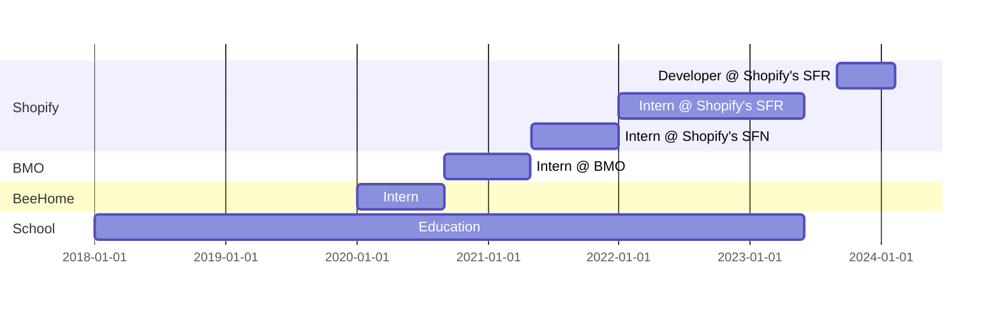

Hey there! 👋 

I'm **Trevor Clarke,** a human based in Canada. I work for [Shopify](https://github.com/Shopify) and contribute to [Storefront Renderer](https://shopify.engineering/how-shopify-reduced-storefront-response-times-rewrite).

So far I've experienced <b>5 years of school</b>, <b>6 internships</b>, and countless <b>amazing people</b>.

If you'd like to get in touch, reach out to me on [linkedin](https://linkedin.com/in/trevorclarketc).

<i>click to see a timeline</i>
    

    

    

 

    
| [`bookshelf`](/books/README.md) | `#todo` | `#todo`  |
| -------- | ----------------------------- | -------- |

