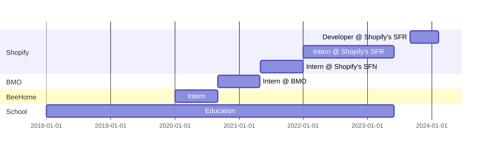

    
| About Me | [Bookshelf](/books/README.md) | Column 3 |
| -------- | ----------------------------- | -------- |

👋 Hey there! 

I'm **Trevor Clarke,** a human based out of Canada. I work for [Shopify](https://github.com/Shopify) and contribute to [Storefront Renderer](https://shopify.engineering/how-shopify-reduced-storefront-response-times-rewrite).

So far, I've done 5 years of school, 6 internships and countless amazing people.

    

    <i>see timeline</i>

---

---

## 📫 How to reach me:

You can connect with me on LinkedIn, I'll be happy to see you there!

---

