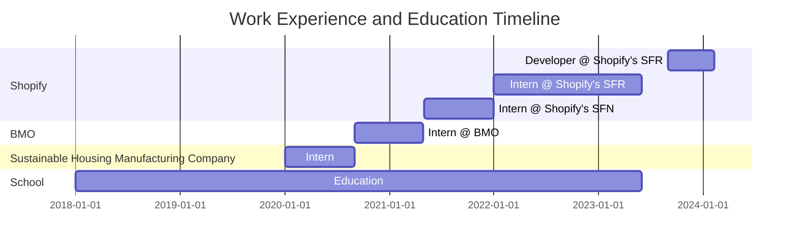

# Hi there, I'm Trevor Clarke 👋

### A Passionate Software Developer from Canada 🍁

---

I'm currently contributing to the growth of Shopify, working on our [Storefront Renderer](https://shopify.engineering/how-shopify-reduced-storefront-response-times-rewrite). I'm always open to collaborating on interesting projects and innovative ideas. Feel free to reach out to me!

---

---

---

## 📫 How to reach me:

You can connect with me on LinkedIn, I'll be happy to see you there!

---
